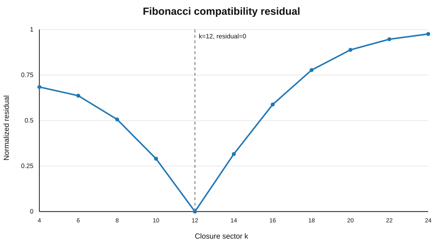
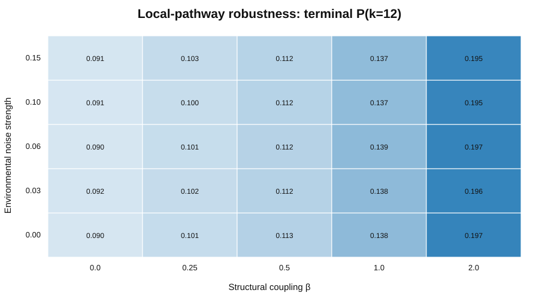
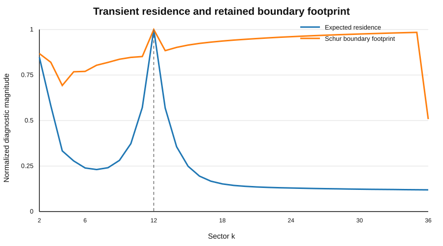
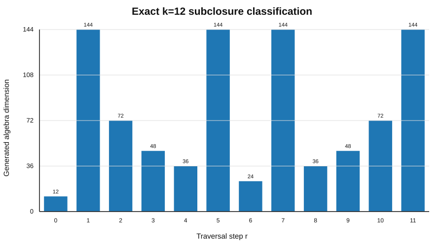

# EDF Dynamic Closure — Computational Repository

This repository contains the computational implementation, numerical diagnostics, algebraic certificates, tables, and visualization resources developed for the **Entropic Dynamic Framework (EDF) Dynamic Closure program**.

The associated Version-2 theoretical manuscript is maintained **separately** while it undergoes journal evaluation. The manuscript source is not part of this public repository.

## What is public here

- Dynamic Closure Notebook entries 01–16 as executable Python scripts;
- exact and numerical tables used to audit the closure construction;
- robustness, null-control, transient-pathway, and falsification diagnostics;
- finite Weyl / matrix-algebra certificates;
- selected publication-quality figures derived directly from the notebook calculations;
- reproducibility and claim-status documentation.

The repository is intended to stand as an independent computational record. It is not contingent on acceptance of any particular manuscript.

---

## Central mathematical chain

For a resolved finite phase space with primitive transitive traversal, the notebook verifies the full matrix-algebra closure

```math
\text{resolved finite phase}
\longrightarrow
\text{primitive transitive traversal}
\longrightarrow
M_k(\mathbb C)
\longrightarrow
C(k)=k^2.
```

EDF then studies the separately stated Fibonacci Compatibility Condition

```math
F_k=C(k),
```

which gives

```math
F_k=k^2.
```

For the tested nontrivial sector range, the exact equality occurs at

```math
F_{12}=144=12^2.
```

The notebook also verifies the nonprimitive subclosure relation

```math
\operatorname{alg}(Z,X^r)
\cong
\bigoplus_{\alpha=1}^{d}M_{k/d}(\mathbb C),
\qquad d=\gcd(k,r),
```

with generated dimension

```math
C_r(k)=\frac{k^2}{d}.
```

For $k=12$, the accessible dimensions are

```math
12,\;24,\;36,\;48,\;72,\;144.
```

---

## Featured computational results

| Result | Notebook source | Representative output | Status |
|---|---:|---:|---|
| Fibonacci compatibility minimum | Entries 02–03 | detected sector $k=12$ | exact residual minimum |
| Pair-count equality | Entry 02 | $F_{12}=12^2=144$ | exact |
| Local-pathway robustness | Entry 03 | $P(k=12)=0.194620$ at $\beta=2$, noise = 0.15 | stochastic simulation |
| Transient boundary-memory model | Entry 10 | baseline $P(\mathrm{commit}\to k=12)=0.480253$ | reduced dynamics / numerical evaluation |
| Schur reduction preservation | Entry 10 | max error $1.554\times10^{-15}$ | numerical precision |
| Exact subclosure capacities | Entry 16 | $12,24,36,48,72,144$ | exact algebra |

Machine-readable index: [`tables/featured_results.csv`](tables/featured_results.csv).

### 1. Fibonacci compatibility residual

The normalized residual

```math
B_k=\frac{|F_k-k^2|}{F_k+k^2}
```

reaches zero at $k=12$ for the even-sector scan used in Entries 02–03.



Data: [`tables/structural_scores.csv`](tables/structural_scores.csv)  
Source: [`notebook/entry_02/dynamic_closure_notebook_entry_02.py`](notebook/entry_02/dynamic_closure_notebook_entry_02.py)

### 2. Local-pathway robustness under environmental noise

Entry 03 replaces all-to-all transitions by the local topology

```math
k\leftrightarrow k\pm2,
```

and scans structural coupling $\beta$ against environmental noise. At $\beta=0$, the model provides the unbiased dynamical control; increasing $\beta$ tests the influence of the independently specified structural score.



Data: [`tables/phase_summary.csv`](tables/phase_summary.csv)  
Source: [`notebook/entry_03/dynamic_closure_notebook_entry_03.py`](notebook/entry_03/dynamic_closure_notebook_entry_03.py)

### 3. Transient-state causality and boundary footprints

Entry 10 uses the absorbing-process identities

```math
N=(-Q)^{-1},\qquad B=NR,
```

and the one-state Schur reduction

```math
Q_{\mathrm{eff}}
=Q_{AA}-Q_{Aj}Q_{jj}^{-1}Q_{jA},
```

```math
R_{\mathrm{eff}}
=R_A-Q_{Aj}Q_{jj}^{-1}R_j.
```

Although transient occupation vanishes asymptotically, expected residence, pathway intervention effects, and Schur-complement boundary terms remain nonzero. For the configured scan, all 35 transient sectors have nonzero expected residence and nonzero boundary footprint; all 32 tested interior non-target interventions produce a positive soft-block effect on the target probability.



Summary data: [`tables/entry10_boundary_memory_summary.csv`](tables/entry10_boundary_memory_summary.csv)  
Source: [`notebook/entry_10/dynamic_closure_notebook_entry_10.py`](notebook/entry_10/dynamic_closure_notebook_entry_10.py)

### 4. Exact $k=12$ subclosure classification

For $U_r=X^r$, Entry 16 classifies every traversal step by

```math
d=\gcd(12,r),\qquad
\ell=\frac{12}{d},\qquad
C_r(12)=\frac{144}{d}.
```

Primitive steps $r=1,5,7,11$ generate the full 144-dimensional algebra; nonprimitive steps generate the exact lower-dimensional subclosures shown below.



Data: [`tables/k12_step_algebra_classification.csv`](tables/k12_step_algebra_classification.csv)  
Source: [`notebook/entry_16/dynamic_closure_notebook_entry_16.py`](notebook/entry_16/dynamic_closure_notebook_entry_16.py)

---

## Notebook map

| Entry | Main role |
|---:|---|
| 01 | Null stochastic dynamics |
| 02 | Candidate Fibonacci pair-closure functional |
| 03 | Local pathway and environmental robustness |
| 04 | Pair-space derivation and arithmetic uniqueness |
| 05 | Weyl-generated closure algebra |
| 06 | Phase and traversal generators |
| 07 | Primitive phase evolution |
| 08 | Dynamic Closure Theorem consolidation |
| 09 | Closure defect and selection functional |
| 10 | Transient-state causality and boundary memory |
| 11 | Robustness and falsification |
| 12 | Alternative-structure premise audit |
| 13 | EDF theorem-prediction correspondence |
| 14 | Theorem repair and prediction reconstruction |
| 15 | Repository / computational consolidation |
| 16 | Premise minimality and exact subclosure algebra |

The chronology is deliberately retained because failed stronger formulations, controls, and premise audits are part of the computational record rather than being silently removed.

---

## Repository layout

```text
edf-dynamic-closure-v2/
├── README.md
├── CITATION.cff
├── REPRODUCIBILITY.md
├── requirements.txt
├── docs/
│   ├── CLAIM_STATUS.md
│   ├── MIGRATION_NOTE.md
│   └── STATUS.md
├── notebook/
│   ├── entry_01/
│   ├── ...
│   └── entry_16/
├── figures/
│   ├── structural_residual.svg
│   ├── local_pathway_robustness.svg
│   ├── transient_boundary_memory.svg
│   └── k12_subclosure_dimensions.svg
└── tables/
    ├── featured_results.csv
    ├── structural_scores.csv
    ├── phase_summary.csv
    ├── entry10_boundary_memory_summary.csv
    └── k12_step_algebra_classification.csv
```

---

## Scientific-status discipline

The repository distinguishes exact or conditional mathematics from proposed EDF-to-physics identifications. In particular:

- the exact $\mathbb Z_3$ factor does not by itself derive the observed fermion generations;
- conditional braid closure does not by itself derive QCD confinement;
- $C(12)=144$ does not by itself derive Newton's constant;
- finite internal dimension does not by itself establish ultraviolet finiteness;
- entropy descent in the computational models does not by itself identify the projection hierarchy with physical time.

These distinctions are part of the framework's falsifiability and claim-status discipline.

See [`docs/CLAIM_STATUS.md`](docs/CLAIM_STATUS.md).

---

## Reproducibility

Install the Python dependencies listed in [`requirements.txt`](requirements.txt), then execute the notebook-entry scripts individually. Each entry writes its detailed outputs to a dedicated runtime output directory.

For the repository-level reproducibility notes, see [`REPRODUCIBILITY.md`](REPRODUCIBILITY.md).

The curated figures and tables in `figures/` and `tables/` are front-page extracts of the same calculations; the entry scripts remain the authoritative computational definitions.

---

## Relationship to the theoretical manuscript

This repository is the **public computational companion** to ongoing EDF theoretical work. The journal manuscript is maintained separately during editorial and referee evaluation and is not distributed here.

The computational record may therefore remain public independently of the publication outcome of any particular paper.

---

## Citation

Citation metadata for this repository are provided in [`CITATION.cff`](CITATION.cff).

When results from a specific notebook entry are used, please identify the entry number and repository version or commit in addition to citing the associated theoretical work when available.

## License

No open-source license is imposed in this repository at present. Until the author selects a license, ordinary copyright restrictions apply.
